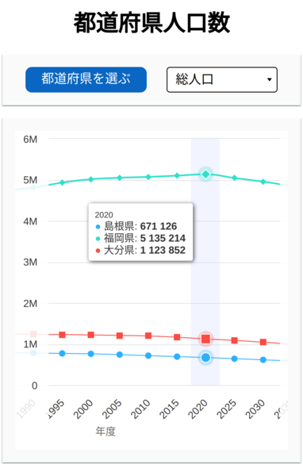
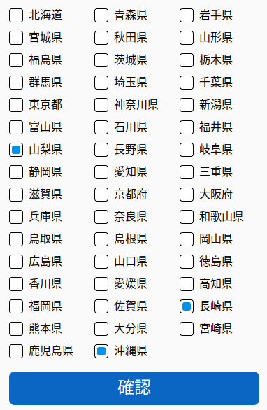

# yumemi-test

## Overview

This application serves to view statistics on the population change of Japan's prefectures in different years.


### Mobile

The interface automatically adapts to devices with small screen sizes: the list of prefectures is displayed on a separate screen, the graph becomes more compact, and so on.





### Resas API

The application uses the [Resas API](https://opendata.resas-portal.go.jp/docs/api/v1/index.html) to retrieve statistics, so you may need to enter your personal API key before starting.


For convenient development, you can use environment variables to specify the API key. For example, it can be specified in the _.env.local_ file. In this case, the screen for entering the key will not appear.

```
VITE_RESAS_API_KEY=6UxrytHy48tPWUdrbEobXmoew8brj8
```

### CI/CD

[Github Actions](.github/workflows) are used to automatically build, test, and deploy an application on [Github Pages](https://become-iron.github.io/yumemi-test/).

## Project Setup

```sh
npm install
```

### Compile and Hot-Reload for Development

```sh
npm run dev
```

### Type-Check, Compile and Minify for Production

```sh
npm run build
```

### Run Unit Tests

```sh
npm run test:unit
```

### Lint with

```sh
npm run lint
```
